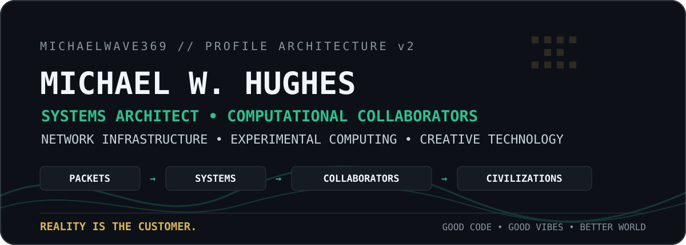
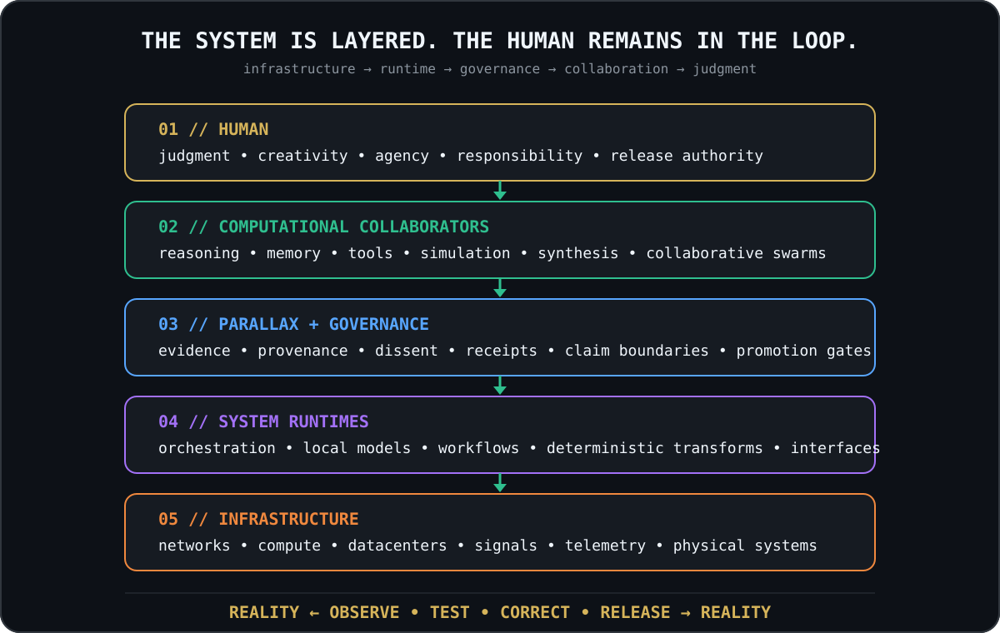

<div align="center">



### Builder of inspectable systems for humans, machines, and the messy reality between them.

`NETWORKS` · `LOCAL-FIRST AI` · `COMPUTATIONAL COLLABORATORS` · `GOVERNANCE` · `SIMULATION` · `CREATIVE COMPUTING`

</div>

---

## Hello — I'm Michael "Mikey" Hughes

I'm a **network infrastructure specialist, systems builder, and experimental computing architect** working across the boundary between physical infrastructure and computational systems.

I started close to the wire: devices, networks, field failures, signal paths, hardware, people, and the practical reality that systems either work or they do not.

That perspective now carries into the software I build.

I explore how humans and **Computational Collaborators (CCs)** can reason, build, simulate, verify, remember, and create together without hiding uncertainty or handing authority to a black box.

> **How do we build increasingly powerful computational systems without losing evidence, agency, understandability, creativity, or the human being at the center of them?**

That question connects most of the strange-looking repositories on this page.

---

## What I actually build

| Domain | What lives there |
|---|---|
| **Infrastructure & Physical Systems** | Networks, datacenter intelligence, telemetry, signal paths, observability, field systems, public-data infrastructure tooling |
| **Computational Collaborators** | Local models, agent/tool orchestration, memory, collaborative reasoning, multi-model workflows, human-in-the-loop architectures |
| **Governance & Verifiable Computing** | Evidence, provenance, receipts, lineage, claim boundaries, deterministic validation, adversarial review, release gates |
| **Simulation & Experimental Systems** | Research workbenches, alternate representations, model crucibles, scenario environments, falsifiable prototypes |
| **Creative Computing** | Visual workstations, interactive worlds, retro interfaces, music/game experiments, posters, pixel environments, playful developer tools |

The creative work is not separate from the engineering. It is how I make complex systems **legible, inviting, and worth exploring**.

---

## The architecture behind the repos

<div align="center">



</div>

The stack is intentionally layered:

**Infrastructure gives us signals. Runtimes transform them. Governance keeps claims bounded. Computational collaborators help reason over them. Humans retain judgment and release authority.**

And the entire loop answers to the same thing:

> ### Reality is the customer.

---

## Selected public systems

These are useful entry points into the larger body of work.

| System | What it explores |
|---|---|
| **[DataCenterLedger Explorer](https://github.com/MichaelWave369/datacenter-ledger-explorer)** | Local-first, public-data, receipt-backed infrastructure registry and review tooling |
| **[Parallax Watchtower](https://github.com/MichaelWave369/parallax-watchtower)** | Public-signal situational awareness with visible confidence, privacy boundaries, and source receipts |
| **[Governance Drift / RSDC](https://github.com/MichaelWave369/governance-drift-rsdc)** | Claim-disciplined research framework for detecting governance drift in AI-assisted workflows |
| **[Flow Covenant Runtime](https://github.com/MichaelWave369/flow-covenant-runtime)** | Local-first decision/governance workbench with explicit claim-safe boundaries |
| **[PhiOS](https://github.com/MichaelWave369/PhiOS)** | Experimental sovereign/local-first operator shell and runtime interface architecture |
| **[PhiOffice369](https://github.com/MichaelWave369/phioffice369)** | Local-first AI-assisted productivity-suite experiment for living artifacts |
| **[PHI369 Element Spiral Atlas](https://github.com/MichaelWave369/phi369-element-spiral-atlas)** | Experimental scientific visualization interface for comparing alternate periodic-table projections against known data |
| **[Auralith369](https://github.com/MichaelWave369/Auralith369)** | Local-first visual workstation with project manifests and auditable creative receipts |
| **[FrontPorchAI](https://github.com/MichaelWave369/FrontPorchAI)** | Plainspoken AI literacy for families: useful without fear, hype, or blind trust |

Not every project is the same kind of artifact. Some are working software, some are research frameworks, some are experimental interfaces, and some are speculative architectures meant to generate **testable questions rather than automatic conclusions**.

---

## Parallax engineering principles

```text
REALITY IS THE CUSTOMER.

Evidence            > confidence
Receipts            > recollection
Provenance          > authority
Multiple hypotheses > premature certainty
Human agency        > automated authority
Local capability    > unnecessary dependency

Governance should constrain claims, not curiosity.
Speculation is welcome when it remains labeled speculation.
Beauty and rigor are not enemies.
```

A useful system should be able to say not only **what it thinks**, but also:

- what it observed,
- where the information came from,
- what was inferred,
- what remains uncertain,
- what changed,
- and who or what authorized the next step.

---

## Computational Collaborators

I use **Computational Collaborator** instead of treating every useful model as an autonomous "agent."

A collaborator can contribute reasoning, memory, synthesis, simulation, code, critique, or tools while remaining inside an explicit relationship with human judgment and system governance.

The interesting problem is not simply making AI *more autonomous*.

It is making collaboration **more capable without becoming less inspectable**.

```text
Human intent
    ↓
Collaborator hypothesis
    ↓
Evidence / tools / simulation
    ↓
Receipt + provenance
    ↓
Adversarial / parallax review
    ↓
Human release
    ↓
World feedback
    ↺
```

---

## The laboratory

My current experiments tend to cluster around:

```text
COMPUTATIONAL COLLABORATION
├── reasoning
├── memory
├── local models
├── tool use
├── multi-model swarms
└── governed autonomy

PARALLAX / GOVERNANCE
├── evidence
├── provenance
├── falsification
├── perception
├── dissent
└── deterministic receipts

SIMULATION + MEASUREMENT
├── scenario environments
├── alternate representations
├── model comparison
├── research workbenches
└── falsifiable experimental architectures

INFRASTRUCTURE
├── networks
├── datacenters
├── compute
├── telemetry
└── physical-world signals

CREATIVE COMPUTING
├── interactive worlds
├── visual systems
├── music + games
├── retro interfaces
└── weird little pixel dudes
```

That last branch is important. 😄

---

## Yes, the magical pixel guy still lives here

<div align="center">


### The Wave Rider is the creative signature — not the limit of the work.

</div>

I still love strange worlds, glowing consoles, pixel laboratories, impossible machines, games, music, and interfaces that make technology feel alive.

The difference now is that the worlds sit **on top of an architecture**.

```text
Packets → Systems → Collaborators → Simulations → Worlds
```

The magic stayed.

The systems underneath it got much deeper.

---

## Build loop

```text
Need / Question
      ↓
Observe the world
      ↓
Separate evidence from hypothesis
      ↓
Model the system
      ↓
Write the contract / spec
      ↓
Build the smallest useful instrument
      ↓
Test + falsify
      ↓
Generate receipts
      ↓
Adversarial / parallax review
      ↓
Human release
      ↓
Observe again
      ↺
```

I like software that leaves a trail another person can inspect.

---

## Tools I reach for

**Software:** TypeScript, JavaScript, React, Vite, Next.js, Electron, Expo, Python  
**AI / Compute:** local models, Ollama, multi-model orchestration, structured outputs, tool-driven workflows  
**Systems:** networking, field infrastructure, telemetry, datacenter research, local-first storage  
**Governance:** JSON schemas, deterministic transforms, provenance, receipts, review gates, GitHub-based release workflows  
**Creative:** visual interfaces, pixel art, interactive environments, audio/music systems, experimental UI

I care less about collecting technologies than about choosing the smallest stack that can make a system **understandable and useful**.

---

## Names you'll see around here

**PHI369 Labs** — my experimental workshop and build language.  
**Parallax** — the broader pattern for looking at systems from multiple viewpoints while keeping evidence and uncertainty visible.  
**Wave Rider / MichaelWave369** — the creative signature that ties the technical and artistic work together.

The names can be playful.

The claim boundaries should not be.

---

## Current direction

I'm especially interested in the intersection of:

**computational collaborators × local-first computing × provenance × simulation × network/datacenter infrastructure × human agency**

The long-term goal is not one giant application.

It is a family of interoperable instruments that help people **see systems more clearly, collaborate with computation more safely, and build things that can explain how they got there**.

---

<div align="center">

### Build useful things. Keep the evidence attached. Leave room for wonder.

`GOOD CODE • GOOD VIBES • BETTER WORLD`

<sub>[Profile v1 archive](./archive/PROFILE_V1_2026-08-09.md) · MichaelWave369</sub>

</div>
