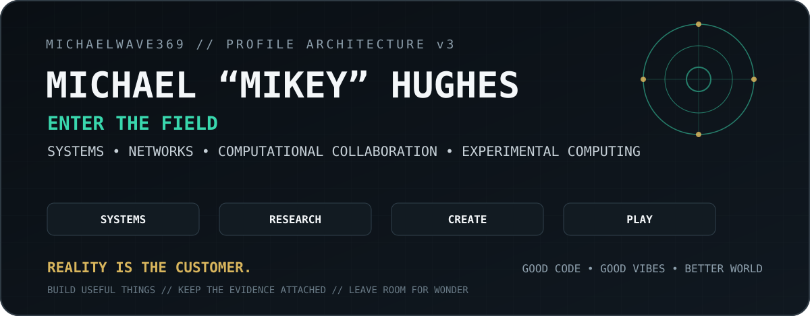
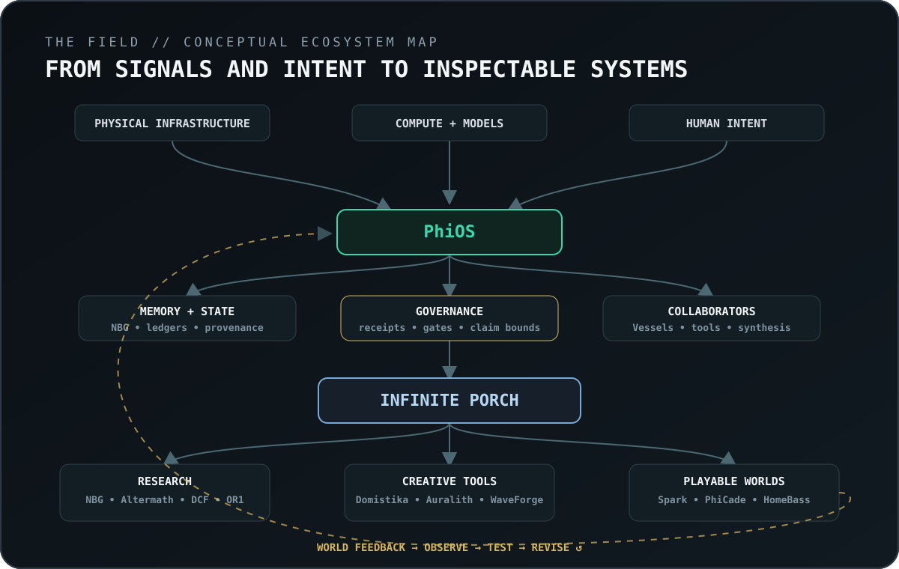

<div align="center">



### Builder of inspectable systems for humans, machines, networks, research, and the messy reality between them.

`NETWORKS` · `LOCAL-FIRST COMPUTING` · `COMPUTATIONAL COLLABORATION` · `GOVERNANCE` · `RESEARCH` · `CREATIVE COMPUTING`

</div>

---

## Enter the Field

I'm **Michael "Mikey" Hughes** — a network infrastructure specialist, systems builder, and experimental computing architect.

I started close to the wire: devices, networks, signal paths, hardware, field failures, and the practical reality that a system eventually has to meet the world.

That perspective now carries into the software, research environments, creative tools, and computational collaborators I build.

The common question is simple:

> **How do we make increasingly capable computational systems without losing evidence, agency, provenance, curiosity, or the human being at the center?**

This GitHub is the workshop.

### Choose an entry point

| **SYSTEMS** | **RESEARCH** | **CREATE** | **PLAY** |
|---|---|---|---|
| [PhiOS](https://github.com/MichaelWave369/PhiOS) | [Nested Bubble Gear](https://github.com/MichaelWave369/NestedBubbleGear) | [Domistika](https://github.com/MichaelWave369/Domistika) | [PhiCade](https://github.com/MichaelWave369/PhiCade) |
| [Infinite Porch](https://github.com/MichaelWave369/Infinite-Porch) | [Governance Drift / RSDC](https://github.com/MichaelWave369/governance-drift-rsdc) | [Auralith369](https://github.com/MichaelWave369/Auralith369) | [HomeBass](https://github.com/MichaelWave369/HomeBass) |
| [Super Φ.Vessel](https://github.com/MichaelWave369/SuperPhiVessel) | [Φ369 Research Lab](https://zenodo.org/communities/enter-the-field-phi369/records) | [WaveForge Studio](https://github.com/MichaelWave369/WaveForgeStudio) | [JukeBot](https://github.com/MichaelWave369/JukeBot) |
| [Commonline](https://github.com/MichaelWave369/Commonline) | Experimental protocols + negative controls | [ParaCut](https://github.com/MichaelWave369/paracut) | [Spark: The Substrate](https://spark-substrate.microneesia79.chatgpt.site/) |

<div align="center">

### [Browse the complete Field Index →](./FIELD_INDEX.md)

108 public repositories organized by system, research line, creative tool, world, utility, and Field role.

</div>

---

## What's alive now

These are some of the projects that best represent the current Field.

| Project | What it is exploring | State |
|---|---|---|
| **[PhiOS](https://github.com/MichaelWave369/PhiOS)** | A governed, local-first operator environment for tools, memory, interfaces, and computational collaboration | `ACTIVE BUILD` |
| **[Infinite Porch](https://github.com/MichaelWave369/Infinite-Porch)** | A community compute / communication fabric for connecting people, machines, and local capability | `ACTIVE BUILD` |
| **[Nested Bubble Gear](https://github.com/MichaelWave369/NestedBubbleGear)** | Experimental work on hidden microstructure, observable closure, memory, coarse representations, and recoverability | `RESEARCH` |
| **[Super Φ.Vessel](https://github.com/MichaelWave369/SuperPhiVessel)** | A governed multi-model collaboration environment with explicit roles, routing, receipts, and human release authority | `ACTIVE LAB` |
| **[PhiCade](https://github.com/MichaelWave369/PhiCade)** | Agent-native game / emulator runtime experiments where controllers may propose actions while the runtime retains authority | `ACTIVE BUILD` |
| **[Spark: The Substrate](https://spark-substrate.microneesia79.chatgpt.site/)** | A growing playable world and systems laboratory, including synchronized multiplayer experiments | `PLAYABLE` |
| **[Domistika](https://github.com/MichaelWave369/Domistika)** | An agent-accessible creative workstation for procedural drawing, motion, composition, and visual experimentation | `ACTIVE BUILD` |

Not every repository is the same kind of artifact. Some are working software, some are research protocols, some are infrastructure, some are speculative architectures, and some are weird little worlds built because software is allowed to be fun.

---

## The Field map

<div align="center">



</div>

This is a conceptual map, not a claim that every project already implements every layer.

The architecture keeps showing up in different forms:

**signals + human intent → governed computation → inspectable state → collaboration → artifacts → world feedback**

The loop matters more than the logo.

---

## Field principles

```text
REALITY IS THE CUSTOMER.

Evidence            > confidence
Receipts            > recollection
Provenance          > authority
Multiple hypotheses > premature certainty
Human agency        > automated authority
Local capability    > unnecessary dependency

CAPABILITY ≠ AUTHORITY.

Governance should constrain claims, not curiosity.
Speculation is welcome when it remains labeled speculation.
Beauty and rigor are not enemies.
```

A useful system should be able to say not only **what it thinks**, but also:

- what it observed,
- where the information came from,
- what was inferred,
- what remains uncertain,
- what changed,
- and who or what authorized the next step.

---

## Research

A large part of the Field is experimental rather than product-oriented.

Current lines include **Nested Bubble Gear (NBG)**, **Dynamic Causal Foam (DCF)**, **Altermath**, governance / closure experiments, memory and recoverability studies, and formal protocol work.

The research style is intentionally evidence-bounded:

```text
question
  ↓
observable definition
  ↓
protocol
  ↓
positive / negative controls
  ↓
run
  ↓
receipt
  ↓
failure analysis
  ↓
revision or promotion
```

Where possible, experiments keep frozen protocols, explicit thresholds, negative controls, replay artifacts, and clear distinctions between observation and interpretation.

**Research archive:** [Enter the Field | Φ369 Research Lab on Zenodo](https://zenodo.org/communities/enter-the-field-phi369/records)

A failed closure test is useful evidence.

A beautiful theory does not get diplomatic immunity.

---

## Computational Collaborators

I use **Computational Collaborator** for systems that contribute reasoning, critique, memory, synthesis, code, simulation, perception, or tools while remaining inside an explicit relationship with human judgment and system governance.

The goal is not autonomy for its own sake.

It is **more capability without less inspectability**.

```text
Human intent
    ↓
Collaborator hypothesis
    ↓
Evidence / tools / simulation
    ↓
Receipt + provenance
    ↓
Parallax / adversarial review
    ↓
Human release
    ↓
World feedback
    ↺
```

---

## Creative computing

The creative systems are not a side quest.

They are where interface design, agent tooling, procedural systems, audio, visual language, games, and human-computer collaboration get stress-tested in forms people actually want to touch.

| Tool / world | Focus |
|---|---|
| **[Domistika](https://github.com/MichaelWave369/Domistika)** | Procedural drawing, motion, symmetry, composition, agent-accessible visual tools |
| **[Auralith369](https://github.com/MichaelWave369/Auralith369)** | Image treatment, LUT / FX workflows, manifests, capture receipts |
| **[WaveForge Studio](https://github.com/MichaelWave369/WaveForgeStudio)** | Audio and creative-tool experimentation |
| **[ParaCut](https://github.com/MichaelWave369/paracut)** | Video / editing workflow experiments |
| **[PhiCade](https://github.com/MichaelWave369/PhiCade)** | Governed game and emulator architecture |
| **[HomeBass](https://github.com/MichaelWave369/HomeBass)** | Retro social-world / commons experiments |
| **[JukeBot](https://github.com/MichaelWave369/JukeBot)** | Jukebox, playlist, and music-interface experiments |

<div align="center">


### The Wave Rider still lives here.

The systems got deeper. The magic stayed.

</div>

---

## Build loop

```text
Need / Question
      ↓
Observe the world
      ↓
Separate evidence from hypothesis
      ↓
Model the system
      ↓
Write the contract / protocol
      ↓
Build the smallest useful instrument
      ↓
Test + falsify
      ↓
Generate receipts
      ↓
Adversarial / parallax review
      ↓
Human release
      ↓
Observe again
      ↺
```

I like software that leaves a trail another person can inspect.

---

## From packets to worlds

My background is in **network infrastructure and field systems**.

That means I tend to see software less as a pile of screens and more as a chain of relationships:

```text
PACKETS
  ↓
SYSTEMS
  ↓
COMPUTE
  ↓
MEMORY
  ↓
COLLABORATORS
  ↓
TOOLS
  ↓
WORLDS
  ↓
PEOPLE
  ↓
REALITY
  ↺
```

That's why a networking tool, an experimental memory architecture, a governed AI runtime, a pixel-art world, and a music workstation can all belong in the same laboratory.

They are different instruments pointed at the same problem:

> **How do humans and computation build together without losing track of what is real?**

---

## Tools I reach for

**Software:** TypeScript, JavaScript, React, Vite, Next.js, Electron, Expo, Python, Rust  
**AI / Compute:** local models, Ollama, multi-model orchestration, structured outputs, tool-driven workflows  
**Systems:** networking, field infrastructure, telemetry, local-first storage, distributed / peer experiments  
**Governance:** JSON schemas, deterministic transforms, provenance, receipts, review gates, GitHub-based qualification  
**Creative:** visual interfaces, pixel worlds, procedural art, audio / music systems, experimental UI

The stack changes.

The requirement that the system remain understandable does not.

---

## Names you'll see around here

**Enter the Field** — the wider doorway connecting the projects, research, people, and experiments.

**PHI369 Labs** — the experimental workshop / build language.

**Parallax** — a pattern for looking at systems from multiple viewpoints while keeping evidence, dissent, provenance, and uncertainty visible.

**Wave Rider / MichaelWave369** — the creative signature tying the technical and artistic work together.

The names can be playful.

The claim boundaries should not be.

---

## Current direction

I'm especially interested in the intersection of:

**computational collaboration × local-first computing × memory × provenance × simulation × network infrastructure × creative tools × human agency**

The long-term direction is not one giant application.

It is a family of interoperable instruments that help people **see systems more clearly, collaborate with computation more safely, preserve evidence, create strange useful things, and understand how the result got there**.

---

<div align="center">

### Build useful things. Keep the evidence attached. Leave room for wonder.

**REALITY IS THE CUSTOMER.**

`GOOD CODE • GOOD VIBES • BETTER WORLD`

[Field Index](./FIELD_INDEX.md) · [Enter the Field](https://enterthefield.org) · [Research Lab](https://zenodo.org/communities/enter-the-field-phi369/records) · [GitHub](https://github.com/MichaelWave369)

<sub>[Profile v2 archive](./archive/PROFILE_V2_2026-10-06.md) · [Profile v1 archive](./archive/PROFILE_V1_2026-08-09.md)</sub>

</div>
